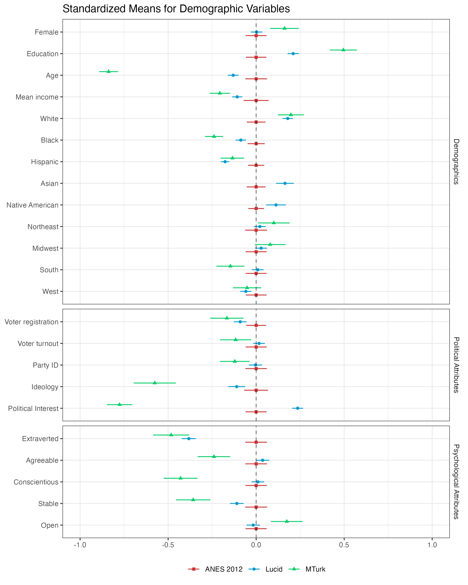
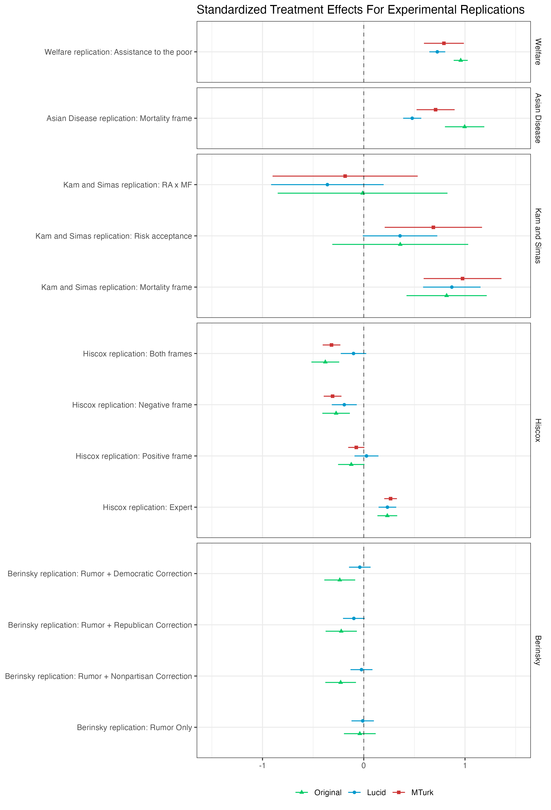

# Active Maintenance Report: coppock_mcclellan_2019


- [Summary](#summary)
  - [Does the deposited archive run?](#does-the-deposited-archive-run)
  - [Does the maintained rewrite reproduce the
    paper?](#does-the-maintained-rewrite-reproduce-the-paper)
- [Paper overview](#paper-overview)
- [Original archive reproducibility](#original-archive-reproducibility)
  - [The stargazer failure](#the-stargazer-failure)
  - [The data file names](#the-data-file-names)
  - [What the archive says it produces, and what the paper
    prints](#what-the-archive-says-it-produces-and-what-the-paper-prints)
- [Errata](#errata)
  - [The appendix Table 1 p-values](#the-appendix-table-1-p-values)
  - [The appendix Table 2 standard
    errors](#the-appendix-table-2-standard-errors)
  - [Where the article disagrees with
    itself](#where-the-article-disagrees-with-itself)
  - [Two findings the deposit does not
    settle](#two-findings-the-deposit-does-not-settle)
- [Bootstrap stability](#bootstrap-stability)
  - [The sampler the archive was written
    under](#the-sampler-the-archive-was-written-under)
- [Ground truth](#ground-truth)
- [Maintained rewrite](#maintained-rewrite)
  - [Deprecated patterns replaced](#deprecated-patterns-replaced)
- [Figures](#figures)
- [In-text numbers](#in-text-numbers)
  - [Coverage, and the second
    instrument](#coverage-and-the-second-instrument)
- [Rewrite verification](#rewrite-verification)
- [R environment](#r-environment)

*Drafted by Claude Opus 5 under the supervision of Alex Coppock.*

This repository holds the actively maintained replication code for
Coppock and McClellan (2019), together with the reproducibility report
that documents what the original archive did and did not do. It is part
of a program applying the maintenance proposal in Peer, Orr and Coppock
(2021, *PS: Political Science & Politics*, doi
[10.1017/S1049096521000366](https://doi.org/10.1017/S1049096521000366))
to a set of published archives.

|  |  |
|----|----|
| Article | [10.1177/2053168018822174](https://doi.org/10.1177/2053168018822174) |
| Replication archive | [10.7910/DVN/DDWWJW](https://doi.org/10.7910/DVN/DDWWJW) |
| Pre-analysis plan | None. The article states that the analyses were not pre-registered. |

**The data are not redistributed here.** The deposit is 29 files and
lives at Harvard Dataverse, which is the only copy this repository
points at. `download_original.R` fetches it and verifies every file;
`original_manifest.csv` pins the file identifiers, sizes and checksums,
so the exact bytes this code was written against are recorded in version
control even though the bytes themselves are not.

**Repository layout.** `maintained/` is the maintained rewrite: one
script per table or figure, writing to `output/`, which is committed so
a reader can compare a fresh run against it without downloading
anything. `ground_truth/` ties every published number to the code that
produces it and holds the extraction of every claim the article makes.
`errata.qmd` builds `coppock_mcclellan_2019_errata.pdf`, which lists the
sentences in the article that the deposited data do not support.
`original/` is created by the download script and is deliberately absent
from the repository. This file is the reproducibility report, also
available as a PDF in `report/`.

**License.** CC0 1.0 Universal, matching the terms of the deposit this
repository maintains. See `LICENSE`.

**To reproduce.** Clone or download the repository, open
`coppock_mcclellan_2019.Rproj`, and run:

``` r
source("run_all.R")
```

That fetches the deposit, verifies its 29 files, and produces every
table and figure into `maintained/output/`. Required packages:
tidyverse, estimatr, broom, scales, matrixStats, rsample, sandwich,
modelsummary, knitr, kableExtra, here. Paths resolve through `here`, so
nothing depends on the working directory and the scripts run equally
well under `Rscript` outside RStudio. Individual scripts can be run on
their own in any order, with one exception: `text_in_text_claims.R`
reads the table outputs, so it comes after them.

The full run takes about nine minutes, eight of them in the two scripts
that repeat the appendix’s bootstrap two hundred times each to measure
how much of it is noise. A successful run overwrites
`maintained/output/`, which is committed: **`git diff` on that folder is
the reproduction check**, and the CSV, TeX and PNG output should come
back byte-identical. The five PDF figures always show as changed,
because a PDF records the time it was written; compare their PNG twins
instead.

# Summary

Two questions, answered before the detail.

## Does the deposited archive run?

On this machine, almost. Eleven of the twelve numbered scripts run to
completion on a current R installation, and every package they name
still installs from CRAN, `coefplot` and `matrixStats` included. The one
script that fails is `06_KamSimasReplicationAnalysis.R`, and it fails
inside `stargazer`, on a bug that turns on how long the names of its
model objects are.

On a case-sensitive filesystem, no. Eleven of the archive’s twelve
`load()` calls name a file the deposit does not contain: the code asks
for `WelfareReplicationStacked.rdata` and Dataverse holds
`WelfareReplicationStacked.RData`. macOS and Windows resolve the
mismatch silently and Linux does not, so ten of the thirteen scripts
halt on their first data line for anyone who downloads the deposit onto
a case-sensitive disk. Details on both below.

The failure lands badly. The published article prints one table, a prose
summary of the five experiments, and its online appendix prints two, the
distance tests and the Kam and Simas probit specifications. Script 06 is
the one that makes the probit table, so exactly one of the paper’s two
numeric tables sits behind the only script that does not run.

And whether it runs is a smaller question than it sounds, because the
deposit writes nothing. Across all thirteen scripts the only uncommented
call that touches a file is one `source()`. Every `ggsave`, `sink`,
`write.csv` and `print.xtable` is commented out, several under the
heading `# Uncomment to save`. Running all twelve numbered scripts in a
scratch copy of the deposit leaves every file in that copy
byte-identical to the deposited version: nothing is created, nothing is
overwritten.

Most of the scripts do not even print. Scripts 01, 02, 03 and 09
assemble their table into an object on the last line and stop, so the
four descriptive tables the archive’s own `README.txt` advertises never
reach the screen either. Scripts 10 and 11 do the same with their plot
objects. What a full run actually emits is four LaTeX tables on standard
output, from scripts 04, 05, 07 and 08, and one line of counts from
script 12. So there is no artifact a reader can compare against the
published paper, and the eleven scripts that run clean cannot be said to
reproduce anything. Reading the numbers back out means capturing them
from the session rather than from files.

30 of the 199 published claims the deposited scripts can be checked
against fail to reproduce. 25 of them are standard errors in appendix
Table 2, and none is a coefficient. 5 of the remaining 5 are places
where the paper disagrees with itself, and the last is a bootstrap
standard error the deposit’s unseeded procedure cannot pin down. See the
errata below.

## Does the maintained rewrite reproduce the paper?

Yes. 194 of the 199 verifiable ground truth claims match the published
values to reported precision. 5 of the 5 that do not are places where
the article disagrees with its own appendix rather than with the code: a
sample size the appendix appears to have copied from a different
experiment, a sample size the appendix’s prose and its own table state
differently, and a count of significant differences that the article
gives as five where the appendix table shows six. The last is a
bootstrap standard error whose published value falls just outside the
range the deposit’s own unseeded procedure produces, discussed under
bootstrap stability below. The remaining 60 recorded quantities are ones
the rewrite computes but the paper never states.

Two published quantities turn out not to mean what the paper says they
mean. The p-values in appendix Table 1 are described as “two-tailed
p-values under a normal approximation” and are not: the archive computes
`pnorm(2 * (1 - |z|))`, which calls a difference significant at the 0.05
level once `|z|` passes 1.82 rather than 1.96. Separately, the deposited
probit script omits the `se = starprep(...)` argument that the OLS call
in the same file carries, so as deposited it would print model-based
standard errors where the published table carries the HC2 robust ones
its note describes. The rewrite reports both quantities in both cases
and changes nothing silently.

A third finding is about precision rather than correctness. The
appendix’s headline count, that Lucid is significantly closer to the
2012 ANES than MTurk on 14 of 21 characteristics, rests on standard
errors from 100 bootstrap resamples drawn without a seed. Running the
deposited procedure 200 times returns 14 on 40% of them and ranges from
12 to 15. The number is not wrong; it is simply not pinned down by the
deposit.

# Paper overview

**Citation**: Coppock, A. and McClellan, O. A. (2019). “Validating the
demographic, political, psychological, and experimental results obtained
from a new source of online survey respondents.” *Research & Politics*,
6(1). DOI: 10.1177/2053168018822174

**Summary**: The paper asks whether the Lucid Fulcrum Exchange is a
usable source of subjects for survey experiments, following the template
Berinsky, Huber and Lenz (2012) used for Mechanical Turk. A single
quota-sampled Lucid sample of 3,504 respondents collected in March 2016
is compared with MTurk, the 2012 ANES, the CPS, the ANES panel, the CCES
and the CCAP on demographics, political attitudes and Big Five traits,
and five experiments are replicated on it: the GSS welfare
question-wording experiment, Tversky and Kahneman’s Asian Disease
problem, Kam and Simas (2010) on risk acceptance and framing, Hiscox
(2006) on free-trade frames, and Berinsky (2017) on death-panel rumor
corrections. Lucid is closer to the 2012 ANES than MTurk on 18 of 21
standardized characteristics, and four of the five experiments recover
treatment effects close to the originals. The exception is the
rumor-correction experiment, where none of the corrections works as well
on Lucid in 2016 as it did on the original sample in 2010.

# Original archive reproducibility

| Script | Status on current R | Resolution |
|:---|:---|:---|
| LucidValidationHelperFunctions.R | Clean (sourced by nine scripts) | No changes required |
| 01_DemographicsTableAnalysis.R | Runs; funs() and melt/dcast deprecation warnings | No changes required |
| 02_PoliticalTableAnalysis.R | Runs; same warnings | No changes required |
| 03_PsychologicalTableAnalysis.R | Runs; same warnings | No changes required |
| 04_WelfareReplicationAnalysis.R | Runs | No changes required |
| 05_AsianDiseaseReplicationAnalysis.R | Runs | No changes required |
| 06_KamSimasReplicationAnalysis.R | FAILS at the first stargazer call | Assign the filtered subsets before fitting, or drop stargazer |
| 07_HiscoxReplicationAnalysis.R | Runs | No changes required |
| 08_HealthRumorsReplicationAnalysis.R | Runs | No changes required |
| 09_SurveyBehaviorTableAnalysis.R | Runs; same warnings | No changes required |
| 10_StandardizedPlots.R | Runs; geom_errorbarh() deprecation warning | geom_linerange(); position_dodge() on the discrete axis |
| 11_StandardizedPlotsHeterogeneousEffects.R | Runs; same warning, plus duplicated scale warnings | Same, and keep one scale per aesthetic |
| 12_DistanceTests.R | Runs; funs() warning and unnest() without cols= | unnest(cols = c(model)) |

Original archive reproducibility, checked against R 4.6.0. Scripts were
run from a scratch copy of the deposit stripped to code and data, and
the deposit’s checksums were re-verified afterwards.

Nothing here is a missing package. `matrixStats`, `coefplot`,
`stargazer`, `xtable`, `reshape2` and `estimatr` all install from CRAN
today. `geom_errorbarh()` is deprecated in ggplot2 4.0 but still draws,
so scripts 10 and 11 produce their figures with a warning rather than an
error, and `coefplot::position_dodgev()` is loaded by both of them and
still works.

The “Runs” in that table means the script reaches its last line without
an error. It does not mean the script produced anything, because none of
them does: the deposit’s every write is commented out, so a complete run
of all twelve leaves the directory exactly as it found it. That is worth
separating from the two defects above, since a script can pass a “does
it run” check while being unable, in principle, to produce a file
anybody could check.

## The stargazer failure

`06_KamSimasReplicationAnalysis.R` fits nine models and passes all nine
to `stargazer`. To label the columns, `stargazer` recovers the names of
the objects it was given:

``` r
object.names.string <- deparse(substitute(list(...)))
.global.object.names.all <- .get.object.names(object.names.string)
```

`deparse()` breaks its output into several strings once the deparsed
expression passes 60 characters, so `object.names.string` is a character
vector rather than a scalar whenever the argument names are long enough.
`.get.object.names()` hands it straight to `.inside.bracket()`, which
opens with

``` r
if (!is.character(s)) return("")
if (is.null(s)) return("")
if (is.na(s)) return("")
if (s == "") return("")
if (length(s) > 1) return("")
```

The guard for a vector argument is the last of the five, three lines
after the `is.na()` that a vector argument breaks. Until R 4.2 a
length-greater-than-one condition in `if` was a warning and the function
limped through; R 4.2 made it an error, and the script now halts with
`the condition has length > 1`.

Nothing about the failure involves `filter()`, the `data =` argument, or
the `==` inside it.
`list(fit_kam_lucid, fit_kam_lucid_ctrl, ... fit_kam_kam_X)` deparses to
three lines; the argument lists of scripts 04, 05, 07 and 08 have
between two and four models with shorter names and deparse to one line
each, which is the whole of the difference. Passing the same nine fitted
models under one-character names produces the table without complaint.
Pre-assigning the filtered subsets before fitting does not help, because
it leaves the nine long argument names exactly where they were.

The consequence is larger than one table. The probit models of appendix
section 2.3.4, and the second `stargazer` call that formats them, sit
below the failing line, so nothing after it runs.

## The data file names

The deposit’s data files are named `.RData` with one exception,
`DemosTableStacked.rdata`. The scripts ask for `.rdata` without
exception. The result is eleven `load()` calls across ten of the
thirteen scripts that name a file the deposit does not contain, and one
call, in `01_DemographicsTableAnalysis.R`, that happens to be right.

| Script | Name requested | Name deposited |
|:---|:---|:---|
| 02_PoliticalTableAnalysis.R | PoliticsTableStacked.rdata | PoliticsTableStacked.RData |
| 03_PsychologicalTableAnalysis.R | PsychTableStacked.rdata | PsychTableStacked.RData |
| 04_WelfareReplicationAnalysis.R | WelfareReplicationStacked.rdata | WelfareReplicationStacked.RData |
| 05_AsianDiseaseReplicationAnalysis.R | AsianDiseaseStacked.rdata | AsianDiseaseStacked.RData |
| 06_KamSimasReplicationAnalysis.R | KamSimasReplicationStacked.rdata | KamSimasReplicationStacked.RData |
| 07_HiscoxReplicationAnalysis.R | HiscoxReplicationStacked.rdata | HiscoxReplicationStacked.RData |
| 08_HealthRumorsReplicationAnalysis.R | HealthRumorsReplicationStacked.rdata | HealthRumorsReplicationStacked.RData |
| 09_SurveyBehaviorTableAnalysis.R | SurveyBehavior.rdata | SurveyBehavior.RData |
| 10_StandardizedPlots.R | StandardizedDemos.rdata | StandardizedDemos.RData |
| 10_StandardizedPlots.R | StandardizedExperiments.rdata | StandardizedExperiments.RData |
| 11_StandardizedPlotsHeterogeneousEffects.R | standardizedExperimentsHeterogeneousEffects.rdata | standardizedExperimentsHeterogeneousEffects.RData |

The eleven load() calls whose file name does not match the deposit. Each
runs on macOS and Windows and stops on Linux.

The deposit’s own `README.txt` writes the same twelve names the same
wrong way, ending each in `.rdata`, and gets only
`standardized_stacked_st.rds` right. So the code and the document that
describes it agree with each other and both disagree with the files.
`README.txt` gets two other names wrong too. It lists
`11_StandardizedExperimentsHeterogeneousEffects.R`, and the deposited
file is `11_StandardizedPlotsHeterogeneousEffects.R`. It assigns
“Appendix Table 1” to two different scripts, 06 and 12, and only one of
them can be right: script 12 makes appendix Table 1 and the probit half
of script 06 makes appendix Table 2.

This class of defect cannot be detected by running the archive on the
machine it was written on, and it is invisible to a checksum, which
verifies the bytes of a file and says nothing about the name a script
uses to ask for it. The maintained rewrite spells every one of these
names exactly as the deposit does, and none of the deposited files was
renamed to accommodate it.

## What the archive says it produces, and what the paper prints

The deposited `README.txt` maps its scripts onto nine numbered tables:

> `01_DemographicsTableAnalysis.R` (Produces Table 1) …
> `09_SurveyBehaviorTableAnalysis.R` (Produces Table 9)

No such tables appear in the published article or in the online
appendix. The article’s only table is a prose summary of the theoretical
scope of the five experiments; the appendix has two, the distance tests
of section 1 and the probit specifications of section 2.3.4. The nine
numbered tables belong to an earlier draft, and the article’s own text
still points at one of them: “included in the online appendix, Table 2”
is used twice, for political knowledge and for policy preferences, and
the appendix’s Table 2 is the probit table.

That leaves the demographic, political, psychological, welfare, Asian
Disease, Kam and Simas OLS, Hiscox, Berinsky and survey-behavior results
with no published form other than the standardized versions plotted in
Figures 1 and 2 and a handful of numbers quoted in prose. All nine are
computed here, under the archive’s own numbering, and each script says
in its header that the number is the archive’s rather than the paper’s.
The prose numbers are checked one by one in
`maintained/text_in_text_claims.R`.

Every `value_paper` in this repository’s ground truth is transcribed
from the article or the online appendix and from nowhere else.
Quantities the paper does not state are left blank rather than filled
from a script run, which is why the nine archive tables contribute rows
to the ground truth without contributing comparisons.

# Errata

Two published quantities do not come from the procedure the paper
describes. Neither is a coding slip that the maintained rewrite silently
corrects: both are reported in both forms, so the published number stays
reproducible and the intended one is available beside it.

Six sentences in the article and its appendix state something the
deposited data do not support. They are collected in
`coppock_mcclellan_2019_errata.pdf` at the root of this repository,
built by `errata.qmd`, which recomputes every number in every corrected
sentence from the deposit each time it is rendered. None of the six
changes a conclusion. What follows here is the analysis behind them,
plus two further findings that could not go in an errata because the
deposit does not settle what the corrected sentence should say.

## The appendix Table 1 p-values

Section 1 of the online appendix says the standard errors come from a
nonparametric bootstrap and that “we obtain two-tailed p-values under a
normal approximation.” The archive’s `12_DistanceTests.R` computes

``` r
p = pnorm(q = 2 * (1 - abs(lucid_is_closer / se)), lower.tail = TRUE)
```

which is not a p-value for any hypothesis. A two-tailed
normal-approximation p-value is `2 * pnorm(-abs(z))`. The two
expressions agree in spirit and differ in threshold: the archive’s calls
a difference significant at 0.05 once `|z|` exceeds 1.82, where the
two-tailed test needs 1.96. The published p-value column reproduces
exactly under the archive’s expression and not under the two-tailed one,
so the published table is the archive’s expression, not the appendix’s
description of it.

| Variable           | Published | Archive expression | Two-tailed |
|:-------------------|----------:|-------------------:|-----------:|
| Female             |     0.000 |              0.000 |      0.003 |
| Education          |     0.000 |              0.000 |      0.000 |
| Age                |     0.000 |              0.000 |      0.000 |
| Mean income        |     0.000 |              0.000 |      0.006 |
| White              |     0.873 |              0.883 |      0.686 |
| Black              |     0.000 |              0.000 |      0.000 |
| Hispanic           |     0.357 |              0.382 |      0.250 |
| Northeast          |     0.179 |              0.110 |      0.107 |
| Midwest            |     0.409 |              0.373 |      0.245 |
| South              |     0.010 |              0.009 |      0.029 |
| West               |     0.948 |              0.945 |      0.842 |
| Voter registration |     0.157 |              0.186 |      0.148 |
| Voter turnout      |     0.000 |              0.000 |      0.003 |
| Party ID           |     0.010 |              0.016 |      0.038 |
| Ideology           |     0.000 |              0.000 |      0.000 |
| Political Interest |     0.000 |              0.000 |      0.000 |
| Extraverted        |     0.034 |              0.037 |      0.059 |
| Agreeable          |     0.001 |              0.000 |      0.003 |
| Conscientious      |     0.000 |              0.000 |      0.000 |
| Stable             |     0.000 |              0.000 |      0.000 |
| Open               |     0.005 |              0.002 |      0.013 |

Appendix Table 1 p-values under the archive’s expression and under the
two-tailed test the appendix describes. Bootstrap standard errors are
stochastic, so the reproduced column will not agree digit for digit with
the published one; see the stability section.

What turns on it: the appendix reports that Lucid is significantly
closer to the ANES than MTurk on 14 of the 21 characteristics, and the
two-tailed test gives 13. The variable that changes is extraversion,
whose bootstrap `z` sits between 1.82 and 1.96. In the article, the
sentence “Formal hypothesis tests demonstrate that Lucid is
significantly closer to the ANES 2012 than MTurk on all five traits”
becomes four of five.

## The appendix Table 2 standard errors

The note under appendix Table 2 reads “Robust standard errors are in
parentheses,” and its numbers are HC2 sandwich standard errors,
consistent with the article’s statement that “In all cases, we estimate
HC2 robust standard errors.” The deposited probit `stargazer` call
passes no `se =` argument, unlike the OLS call in the same script, so
the code as deposited would print model-based probit standard errors
instead. All 30 published coefficients, all nine sample sizes, all nine
log-likelihoods and all nine AIC values reproduce exactly. 25 of the 30
published standard errors do not, and 30 of the 30 match once the robust
variance the note describes is used.

The maintained rewrite reports both: `robust.std.error` reproduces the
published table, `std.error` is what the deposited script would print.

## Where the article disagrees with itself

None of these is an archive defect; all are visible only once the
numbers are recomputed.

The article says that of the 11 demographic variables, “the Lucid mean
is closer to the ANES mean in nine instances, five of which are
statistically significant.” Nine is right. The appendix table’s own
p-value column marks six of those nine significant, not five: female,
education, age, mean income, black and south. Six is also the count
under the two-tailed test, so this one does not turn on the p-value
expression above.

“The regional balance on Lucid comes very close to the 2012 ANES,
whereas the MTurk sample appears to overrepresent southerners” has the
direction backwards. The southern share is 30.1 per cent on MTurk
against an ANES 2012 benchmark of 37.2, and Figure 1, where the sentence
sends the reader, puts MTurk 0.146 standard deviations below the
benchmark. MTurk over-represents the Northeast and the Midwest.

Appendix section 2.1.3 gives the Lucid welfare replication a sample of
1,811, which is the Lucid sample size of the Hiscox experiment reported
in section 2.4.2. The welfare data have 3,294 respondents. Appendix
section 2.3.1 gives the original Kam and Simas study 761 respondents
where appendix Table 2 reports 752 for the same models, and section
2.5.1 describes the original Berinsky sample as MTurk where the article
describes it as Survey Sampling International.

## Two findings the deposit does not settle

The article says the Lucid sample corresponds “more closely to the 2012
ANES baseline for voter registration and voter turnout,” and says on the
same page that “MTurk is significantly closer for voter turnout.” Both
statements are supported by a deposited file, and the two files
disagree. The standardized file the distance tests read puts the ANES
2012 turnout benchmark at 0.702, which makes MTurk the closer sample and
gives appendix Table 1 its −0.124; the political table’s weighted mean
puts the same benchmark at 0.756, which makes Lucid the closer sample.
The registration comparison is unaffected and favours Lucid under both.
Choosing between two deposited benchmarks is an analytical decision,
which the rewrite does not make, so this is recorded rather than
corrected.

The heterogeneity section places the welfare replication’s conditional
effects “among both the Lucid sample and respondents in the 2016 GSS,”
twice. The deposited welfare data hold the 1984 and 2014 General Social
Surveys and no other, and the article’s own Experiment 1 section names
the 2014 GSS as the baseline. The deposited
`standardizedExperimentsHeterogeneousEffects.RData` is a pre-computed
table whose comparison sample is labelled “Original” with no year and
which no deposited script builds, so which survey Figure 3’s original
panel draws on cannot be established from the deposit.

# Bootstrap stability

The standard errors of appendix Table 1 come from 100 bootstrap
resamples drawn without a seed, so they are different every time the
deposited script is run, and so are the p-values computed from them and
the counts computed from those. The point estimates are not: they
involve no resampling, and all 21 reproduce to three decimals.

`appendix_table_1_bootstrap_stability.R` runs the archive’s whole
100-resample procedure 200 times and records the spread. A published
standard error is then checked against the sampling distribution of the
estimator rather than against one draw. 20 of the 21 published standard
errors fall inside the 95 per cent range of that distribution. The
exception is political interest, whose published 0.082 sits just above a
range ending at 0.082. One exceedance in 21 variables is what a 95 per
cent interval produces by chance, and the sampler change discussed below
does not widen the range enough to cover it, so the cause is left
unresolved rather than guessed at.

| Variable | Published SE | Mean SE | 95% interval over 200 seeds | Share of seeds significant |
|:---|:---|:---|:---|:---|
| Age | 0.032 | 0.032 | \[0.027, 0.035\] | 1.00 |
| Agreeable | 0.077 | 0.074 | \[0.064, 0.084\] | 1.00 |
| Conscientious | 0.065 | 0.065 | \[0.055, 0.075\] | 1.00 |
| Education | 0.041 | 0.042 | \[0.037, 0.048\] | 1.00 |
| Stable | 0.054 | 0.053 | \[0.046, 0.060\] | 1.00 |
| Extraverted | 0.052 | 0.056 | \[0.048, 0.063\] | 0.39 |
| Female | 0.049 | 0.055 | \[0.047, 0.063\] | 1.00 |
| Ideology | 0.069 | 0.065 | \[0.058, 0.074\] | 1.00 |
| Mean income | 0.033 | 0.033 | \[0.028, 0.037\] | 1.00 |
| Political Interest | 0.082 | 0.072 | \[0.062, 0.082\] | 1.00 |
| Open | 0.069 | 0.065 | \[0.056, 0.074\] | 1.00 |
| Party ID | 0.055 | 0.055 | \[0.047, 0.062\] | 0.99 |
| Black | 0.033 | 0.030 | \[0.026, 0.034\] | 1.00 |
| Hispanic | 0.035 | 0.037 | \[0.031, 0.042\] | 0.00 |
| White | 0.041 | 0.041 | \[0.035, 0.047\] | 0.00 |
| Midwest | 0.046 | 0.045 | \[0.040, 0.052\] | 0.00 |
| Northeast | 0.054 | 0.051 | \[0.044, 0.058\] | 0.01 |
| South | 0.064 | 0.058 | \[0.049, 0.067\] | 1.00 |
| West | 0.039 | 0.039 | \[0.032, 0.044\] | 0.00 |
| Voter registration | 0.050 | 0.052 | \[0.045, 0.059\] | 0.01 |
| Voter turnout | 0.044 | 0.043 | \[0.037, 0.051\] | 1.00 |

How much of appendix Table 1 is Monte Carlo noise: the distribution of
the bootstrap standard error over 200 independent runs of the archive’s
own 100-resample procedure.

The headline count moves too. Across 200 seeds the published figure of
14 significantly closer characteristics comes up 40% of the time, and
the count ranges from 12 to 15. Under the two-tailed test it ranges from
12 to 14. A reader who runs the deposited script once and gets 13 has
not found a reproducibility failure; the deposit simply does not pin the
number down. The maintained rewrite sets a seed so that it does.

## The sampler the archive was written under

The archive was deposited in December 2018. R 3.6.0, released in April
2019, changed how `sample()` maps a stream of uniform draws onto
integers, and `rsample::bootstraps()` resamples through `sample.int()`,
so the standard errors of appendix Table 1 were produced by a generator
no current R installation uses by default.

Whether that matters is a question about the archive, not about the
maintained rewrite, and the two are kept apart.
`appendix_table_1_rounding_sampler.R` re-runs the same 200-seed
procedure under `RNGkind(sample.kind = "Rounding")`, then restores the
sampler explicitly and asserts the restoration, so that nothing
`run_all.R` sources afterwards can inherit the old generator. The
rewrite itself keeps the current sampler, which is the correct one.

Under the old sampler the published count of 14 comes up 45% of the time
and ranges from 12 to 14, against 40% and 12 to 15 under the current
one. The sampler change is not what makes the number move. An unseeded
100-resample bootstrap is, under either generator.

# Ground truth

Every value in `value_paper` is transcribed from the published article
or the published online appendix. Where the paper does not state a
quantity, the cell is blank and the match column is empty.

| Location | Claim | Paper | Archive | Match | Rewrite | Match |
|:---|:---|:---|:---|:---|:---|:---|
| Appendix Table 1 | Distance, Female | 0.159 | 0.159 | 1 | 0.159 | 1 |
| Appendix Table 1 | Distance, Education | 0.285 | 0.285 | 1 | 0.285 | 1 |
| Appendix Table 1 | Distance, Age | 0.708 | 0.708 | 1 | 0.708 | 1 |
| Appendix Table 1 | Distance, Mean income | 0.099 | 0.099 | 1 | 0.099 | 1 |
| Appendix Table 1 | Distance, White | 0.018 | 0.018 | 1 | 0.018 | 1 |
| Appendix Table 1 | Distance, Black | 0.152 | 0.152 | 1 | 0.152 | 1 |
| Appendix Table 1 | Distance, Hispanic | -0.042 | -0.042 | 1 | -0.042 | 1 |
| Appendix Table 1 | Distance, Northeast | 0.079 | 0.079 | 1 | 0.079 | 1 |
| Appendix Table 1 | Distance, Midwest | 0.052 | 0.052 | 1 | 0.052 | 1 |
| Appendix Table 1 | Distance, South | 0.137 | 0.137 | 1 | 0.137 | 1 |
| Appendix Table 1 | Distance, West | -0.007 | -0.007 | 1 | -0.007 | 1 |
| Appendix Table 1 | Distance, Voter registration | 0.076 | 0.076 | 1 | 0.076 | 1 |
| Appendix Table 1 | Distance, Voter turnout | -0.124 | -0.124 | 1 | -0.124 | 1 |
| Appendix Table 1 | Distance, Party ID | 0.117 | 0.117 | 1 | 0.117 | 1 |
| Appendix Table 1 | Distance, Ideology | 0.465 | 0.465 | 1 | 0.465 | 1 |
| Appendix Table 1 | Distance, Political Interest | 0.540 | 0.54 | 1 | 0.54 | 1 |
| Appendix Table 1 | Distance, Extraverted | 0.100 | 0.1 | 1 | 0.1 | 1 |
| Appendix Table 1 | Distance, Agreeable | 0.203 | 0.203 | 1 | 0.203 | 1 |
| Appendix Table 1 | Distance, Conscientious | 0.420 | 0.42 | 1 | 0.42 | 1 |
| Appendix Table 1 | Distance, Stable | 0.248 | 0.248 | 1 | 0.248 | 1 |
| Appendix Table 1 | Distance, Open | 0.157 | 0.157 | 1 | 0.157 | 1 |
| Appendix Table 1 | Bootstrap SE, Female | 0.049 | 0.053 | 1 | 0.053 | 1 |
| Appendix Table 1 | Bootstrap SE, Education | 0.041 | 0.04 | 1 | 0.04 | 1 |
| Appendix Table 1 | Bootstrap SE, Age | 0.032 | 0.033 | 1 | 0.033 | 1 |
| Appendix Table 1 | Bootstrap SE, Mean income | 0.033 | 0.036 | 1 | 0.036 | 1 |
| Appendix Table 1 | Bootstrap SE, White | 0.041 | 0.044 | 1 | 0.044 | 1 |
| Appendix Table 1 | Bootstrap SE, Black | 0.033 | 0.032 | 1 | 0.032 | 1 |
| Appendix Table 1 | Bootstrap SE, Hispanic | 0.035 | 0.036 | 1 | 0.036 | 1 |
| Appendix Table 1 | Bootstrap SE, Northeast | 0.054 | 0.049 | 1 | 0.049 | 1 |
| Appendix Table 1 | Bootstrap SE, Midwest | 0.046 | 0.044 | 1 | 0.044 | 1 |
| Appendix Table 1 | Bootstrap SE, South | 0.064 | 0.063 | 1 | 0.063 | 1 |
| Appendix Table 1 | Bootstrap SE, West | 0.039 | 0.037 | 1 | 0.037 | 1 |
| Appendix Table 1 | Bootstrap SE, Voter registration | 0.050 | 0.052 | 1 | 0.052 | 1 |
| Appendix Table 1 | Bootstrap SE, Voter turnout | 0.044 | 0.042 | 1 | 0.042 | 1 |
| Appendix Table 1 | Bootstrap SE, Party ID | 0.055 | 0.057 | 1 | 0.057 | 1 |
| Appendix Table 1 | Bootstrap SE, Ideology | 0.069 | 0.065 | 1 | 0.065 | 1 |
| Appendix Table 1 | Bootstrap SE, Political Interest | 0.082 | 0.075 | 0 | 0.075 | 0 |
| Appendix Table 1 | Bootstrap SE, Extraverted | 0.052 | 0.053 | 1 | 0.053 | 1 |
| Appendix Table 1 | Bootstrap SE, Agreeable | 0.077 | 0.069 | 1 | 0.069 | 1 |
| Appendix Table 1 | Bootstrap SE, Conscientious | 0.065 | 0.065 | 1 | 0.065 | 1 |
| Appendix Table 1 | Bootstrap SE, Stable | 0.054 | 0.051 | 1 | 0.051 | 1 |
| Appendix Table 1 | Bootstrap SE, Open | 0.069 | 0.064 | 1 | 0.064 | 1 |
| Appendix Table 1 | p-value, Female | 0.000 | 0 | 1 | 0 | 1 |
| Appendix Table 1 | p-value, Education | 0.000 | 0 | 1 | 0 | 1 |
| Appendix Table 1 | p-value, Age | 0.000 | 0 | 1 | 0 | 1 |
| Appendix Table 1 | p-value, Mean income | 0.000 | 0 | 1 | 0 | 1 |
| Appendix Table 1 | p-value, White | 0.873 | 0.883 | 1 | 0.883 | 1 |
| Appendix Table 1 | p-value, Black | 0.000 | 0 | 1 | 0 | 1 |
| Appendix Table 1 | p-value, Hispanic | 0.357 | 0.382 | 1 | 0.382 | 1 |
| Appendix Table 1 | p-value, Northeast | 0.179 | 0.11 | 1 | 0.11 | 1 |
| Appendix Table 1 | p-value, Midwest | 0.409 | 0.373 | 1 | 0.373 | 1 |
| Appendix Table 1 | p-value, South | 0.010 | 0.009 | 1 | 0.009 | 1 |
| Appendix Table 1 | p-value, West | 0.948 | 0.945 | 1 | 0.945 | 1 |
| Appendix Table 1 | p-value, Voter registration | 0.157 | 0.186 | 1 | 0.186 | 1 |
| Appendix Table 1 | p-value, Voter turnout | 0.000 | 0 | 1 | 0 | 1 |
| Appendix Table 1 | p-value, Party ID | 0.010 | 0.016 | 1 | 0.016 | 1 |
| Appendix Table 1 | p-value, Ideology | 0.000 | 0 | 1 | 0 | 1 |
| Appendix Table 1 | p-value, Political Interest | 0.000 | 0 | 1 | 0 | 1 |
| Appendix Table 1 | p-value, Extraverted | 0.034 | 0.037 | 1 | 0.037 | 1 |
| Appendix Table 1 | p-value, Agreeable | 0.001 | 0 | 1 | 0 | 1 |
| Appendix Table 1 | p-value, Conscientious | 0.000 | 0 | 1 | 0 | 1 |
| Appendix Table 1 | p-value, Stable | 0.000 | 0 | 1 | 0 | 1 |
| Appendix Table 1 | p-value, Open | 0.005 | 0.002 | 1 | 0.002 | 1 |
| Appendix Table 1 | Two-tailed p-value, Female |  |  |  | 0.003 |  |
| Appendix Table 1 | Two-tailed p-value, Education |  |  |  | 0 |  |
| Appendix Table 1 | Two-tailed p-value, Age |  |  |  | 0 |  |
| Appendix Table 1 | Two-tailed p-value, Mean income |  |  |  | 0.006 |  |
| Appendix Table 1 | Two-tailed p-value, White |  |  |  | 0.686 |  |
| Appendix Table 1 | Two-tailed p-value, Black |  |  |  | 0 |  |
| Appendix Table 1 | Two-tailed p-value, Hispanic |  |  |  | 0.25 |  |
| Appendix Table 1 | Two-tailed p-value, Northeast |  |  |  | 0.107 |  |
| Appendix Table 1 | Two-tailed p-value, Midwest |  |  |  | 0.245 |  |
| Appendix Table 1 | Two-tailed p-value, South |  |  |  | 0.029 |  |
| Appendix Table 1 | Two-tailed p-value, West |  |  |  | 0.842 |  |
| Appendix Table 1 | Two-tailed p-value, Voter registration |  |  |  | 0.148 |  |
| Appendix Table 1 | Two-tailed p-value, Voter turnout |  |  |  | 0.003 |  |
| Appendix Table 1 | Two-tailed p-value, Party ID |  |  |  | 0.038 |  |
| Appendix Table 1 | Two-tailed p-value, Ideology |  |  |  | 0 |  |
| Appendix Table 1 | Two-tailed p-value, Political Interest |  |  |  | 0 |  |
| Appendix Table 1 | Two-tailed p-value, Extraverted |  |  |  | 0.059 |  |
| Appendix Table 1 | Two-tailed p-value, Agreeable |  |  |  | 0.003 |  |
| Appendix Table 1 | Two-tailed p-value, Conscientious |  |  |  | 0 |  |
| Appendix Table 1 | Two-tailed p-value, Stable |  |  |  | 0 |  |
| Appendix Table 1 | Two-tailed p-value, Open |  |  |  | 0.013 |  |
| Appendix Table 2 | Coefficient, lucid_base, mortalityfirst | 0.898 | 0.898 | 1 | 0.898 | 1 |
| Appendix Table 2 | Coefficient, lucid_ctrl, mortalityfirst | 0.898 | 0.898 | 1 | 0.898 | 1 |
| Appendix Table 2 | Coefficient, lucid_int, mortalityfirst | 1.155 | 1.155 | 1 | 1.155 | 1 |
| Appendix Table 2 | Coefficient, mturk_base, mortalityfirst | 1.182 | 1.182 | 1 | 1.182 | 1 |
| Appendix Table 2 | Coefficient, mturk_ctrl, mortalityfirst | 1.184 | 1.184 | 1 | 1.184 | 1 |
| Appendix Table 2 | Coefficient, mturk_int, mortalityfirst | 1.370 | 1.37 | 1 | 1.37 | 1 |
| Appendix Table 2 | Coefficient, kam_base, mortalityfirst | 1.068 | 1.068 | 1 | 1.068 | 1 |
| Appendix Table 2 | Coefficient, kam_ctrl, mortalityfirst | 1.091 | 1.091 | 1 | 1.091 | 1 |
| Appendix Table 2 | Coefficient, kam_int, mortalityfirst | 1.059 | 1.059 | 1 | 1.059 | 1 |
| Appendix Table 2 | Coefficient, lucid_base, ramean | 0.253 | 0.253 | 1 | 0.253 | 1 |
| Appendix Table 2 | Coefficient, lucid_ctrl, ramean | 0.516 | 0.516 | 1 | 0.516 | 1 |
| Appendix Table 2 | Coefficient, lucid_int, ramean | 0.522 | 0.522 | 1 | 0.522 | 1 |
| Appendix Table 2 | Coefficient, mturk_base, ramean | 0.906 | 0.906 | 1 | 0.906 | 1 |
| Appendix Table 2 | Coefficient, mturk_ctrl, ramean | 0.953 | 0.953 | 1 | 0.953 | 1 |
| Appendix Table 2 | Coefficient, mturk_int, ramean | 1.090 | 1.09 | 1 | 1.09 | 1 |
| Appendix Table 2 | Coefficient, kam_base, ramean | 0.520 | 0.52 | 1 | 0.52 | 1 |
| Appendix Table 2 | Coefficient, kam_ctrl, ramean | 0.587 | 0.587 | 1 | 0.587 | 1 |
| Appendix Table 2 | Coefficient, kam_int, ramean | 0.506 | 0.506 | 1 | 0.506 | 1 |
| Appendix Table 2 | Coefficient, lucid_int, mortalityfirst:ramean | -0.523 | -0.523 | 1 | -0.523 | 1 |
| Appendix Table 2 | Coefficient, mturk_int, mortalityfirst:ramean | -0.368 | -0.368 | 1 | -0.368 | 1 |
| Appendix Table 2 | Coefficient, kam_int, mortalityfirst:ramean | 0.022 | 0.022 | 1 | 0.022 | 1 |
| Appendix Table 2 | Coefficient, lucid_base, (Intercept) | -0.634 | -0.634 | 1 | -0.634 | 1 |
| Appendix Table 2 | Coefficient, lucid_ctrl, (Intercept) | -1.040 | -1.04 | 1 | -1.04 | 1 |
| Appendix Table 2 | Coefficient, lucid_int, (Intercept) | -0.767 | -0.767 | 1 | -0.767 | 1 |
| Appendix Table 2 | Coefficient, mturk_base, (Intercept) | -1.128 | -1.128 | 1 | -1.128 | 1 |
| Appendix Table 2 | Coefficient, mturk_ctrl, (Intercept) | -1.193 | -1.193 | 1 | -1.193 | 1 |
| Appendix Table 2 | Coefficient, mturk_int, (Intercept) | -1.225 | -1.225 | 1 | -1.225 | 1 |
| Appendix Table 2 | Coefficient, kam_base, (Intercept) | -0.705 | -0.705 | 1 | -0.705 | 1 |
| Appendix Table 2 | Coefficient, kam_ctrl, (Intercept) | -0.814 | -0.814 | 1 | -0.814 | 1 |
| Appendix Table 2 | Coefficient, kam_int, (Intercept) | -0.700 | -0.7 | 1 | -0.7 | 1 |
| Appendix Table 2 | SE, lucid_base, mortalityfirst | 0.065 | 0.065 | 1 | 0.065 | 1 |
| Appendix Table 2 | SE, lucid_ctrl, mortalityfirst | 0.065 | 0.065 | 1 | 0.065 | 1 |
| Appendix Table 2 | SE, lucid_int, mortalityfirst | 0.203 | 0.206 | 0 | 0.203 | 1 |
| Appendix Table 2 | SE, mturk_base, mortalityfirst | 0.097 | 0.097 | 1 | 0.097 | 1 |
| Appendix Table 2 | SE, mturk_ctrl, mortalityfirst | 0.098 | 0.098 | 1 | 0.098 | 1 |
| Appendix Table 2 | SE, mturk_int, mortalityfirst | 0.310 | 0.301 | 0 | 0.31 | 1 |
| Appendix Table 2 | SE, kam_base, mortalityfirst | 0.098 | 0.097 | 0 | 0.098 | 1 |
| Appendix Table 2 | SE, kam_ctrl, mortalityfirst | 0.100 | 0.099 | 0 | 0.1 | 1 |
| Appendix Table 2 | SE, kam_int, mortalityfirst | 0.294 | 0.294 | 1 | 0.294 | 1 |
| Appendix Table 2 | SE, lucid_base, ramean | 0.196 | 0.199 | 0 | 0.196 | 1 |
| Appendix Table 2 | SE, lucid_ctrl, ramean | 0.205 | 0.209 | 0 | 0.205 | 1 |
| Appendix Table 2 | SE, lucid_int, ramean | 0.269 | 0.284 | 0 | 0.269 | 1 |
| Appendix Table 2 | SE, mturk_base, ramean | 0.283 | 0.276 | 0 | 0.283 | 1 |
| Appendix Table 2 | SE, mturk_ctrl, ramean | 0.293 | 0.29 | 0 | 0.293 | 1 |
| Appendix Table 2 | SE, mturk_int, ramean | 0.412 | 0.394 | 0 | 0.412 | 1 |
| Appendix Table 2 | SE, kam_base, ramean | 0.303 | 0.306 | 0 | 0.303 | 1 |
| Appendix Table 2 | SE, kam_ctrl, ramean | 0.325 | 0.32 | 0 | 0.325 | 1 |
| Appendix Table 2 | SE, kam_int, ramean | 0.485 | 0.482 | 0 | 0.485 | 1 |
| Appendix Table 2 | SE, lucid_int, mortalityfirst:ramean | 0.393 | 0.399 | 0 | 0.393 | 1 |
| Appendix Table 2 | SE, mturk_int, mortalityfirst:ramean | 0.569 | 0.554 | 0 | 0.569 | 1 |
| Appendix Table 2 | SE, kam_int, mortalityfirst:ramean | 0.621 | 0.623 | 0 | 0.621 | 1 |
| Appendix Table 2 | SE, lucid_base, (Intercept) | 0.106 | 0.108 | 0 | 0.106 | 1 |
| Appendix Table 2 | SE, lucid_ctrl, (Intercept) | 0.176 | 0.177 | 0 | 0.176 | 1 |
| Appendix Table 2 | SE, lucid_int, (Intercept) | 0.141 | 0.148 | 0 | 0.141 | 1 |
| Appendix Table 2 | SE, mturk_base, (Intercept) | 0.163 | 0.161 | 0 | 0.163 | 1 |
| Appendix Table 2 | SE, mturk_ctrl, (Intercept) | 0.281 | 0.28 | 0 | 0.281 | 1 |
| Appendix Table 2 | SE, mturk_int, (Intercept) | 0.229 | 0.219 | 0 | 0.229 | 1 |
| Appendix Table 2 | SE, kam_base, (Intercept) | 0.154 | 0.155 | 0 | 0.154 | 1 |
| Appendix Table 2 | SE, kam_ctrl, (Intercept) | 0.275 | 0.271 | 0 | 0.275 | 1 |
| Appendix Table 2 | SE, kam_int, (Intercept) | 0.229 | 0.227 | 0 | 0.229 | 1 |
| Appendix Table 2 | N, lucid_base | 1629 | 1629 | 1 | 1629 | 1 |
| Appendix Table 2 | Log likelihood, lucid_base | -1027.212 | -1027.212 | 1 | -1027.212 | 1 |
| Appendix Table 2 | AIC, lucid_base | 2060.424 | 2060.424 | 1 | 2060.424 | 1 |
| Appendix Table 2 | N, lucid_ctrl | 1629 | 1629 | 1 | 1629 | 1 |
| Appendix Table 2 | Log likelihood, lucid_ctrl | -1015.762 | -1015.762 | 1 | -1015.762 | 1 |
| Appendix Table 2 | AIC, lucid_ctrl | 2047.524 | 2047.524 | 1 | 2047.524 | 1 |
| Appendix Table 2 | N, lucid_int | 1629 | 1629 | 1 | 1629 | 1 |
| Appendix Table 2 | Log likelihood, lucid_int | -1026.356 | -1026.356 | 1 | -1026.356 | 1 |
| Appendix Table 2 | AIC, lucid_int | 2060.713 | 2060.713 | 1 | 2060.713 | 1 |
| Appendix Table 2 | N, mturk_base | 766 | 766 | 1 | 766 | 1 |
| Appendix Table 2 | Log likelihood, mturk_base | -448.046 | -448.046 | 1 | -448.046 | 1 |
| Appendix Table 2 | AIC, mturk_base | 902.092 | 902.092 | 1 | 902.092 | 1 |
| Appendix Table 2 | N, mturk_ctrl | 766 | 766 | 1 | 766 | 1 |
| Appendix Table 2 | Log likelihood, mturk_ctrl | -447.878 | -447.878 | 1 | -447.878 | 1 |
| Appendix Table 2 | AIC, mturk_ctrl | 911.755 | 911.755 | 1 | 911.755 | 1 |
| Appendix Table 2 | N, mturk_int | 766 | 766 | 1 | 766 | 1 |
| Appendix Table 2 | Log likelihood, mturk_int | -447.823 | -447.823 | 1 | -447.823 | 1 |
| Appendix Table 2 | AIC, mturk_int | 903.646 | 903.646 | 1 | 903.646 | 1 |
| Appendix Table 2 | N, kam_base | 752 | 752 | 1 | 752 | 1 |
| Appendix Table 2 | Log likelihood, kam_base | -453.196 | -453.196 | 1 | -453.196 | 1 |
| Appendix Table 2 | AIC, kam_base | 912.392 | 912.392 | 1 | 912.392 | 1 |
| Appendix Table 2 | N, kam_ctrl | 752 | 752 | 1 | 752 | 1 |
| Appendix Table 2 | Log likelihood, kam_ctrl | -450.863 | -450.863 | 1 | -450.863 | 1 |
| Appendix Table 2 | AIC, kam_ctrl | 917.727 | 917.727 | 1 | 917.727 | 1 |
| Appendix Table 2 | N, kam_int | 752 | 752 | 1 | 752 | 1 |
| Appendix Table 2 | Log likelihood, kam_int | -453.195 | -453.195 | 1 | -453.195 | 1 |
| Appendix Table 2 | AIC, kam_int | 914.391 | 914.391 | 1 | 914.391 | 1 |
| Appendix study manifest | Welfare, GSS 1984 N | 943 | 943 | 1 | 943 | 1 |
| Appendix study manifest | Welfare, GSS 2014 N | 2457 | 2457 | 1 | 2457 | 1 |
| Appendix study manifest | Welfare, Lucid N | 1811 | 3294 | 0 | 3294 | 0 |
| Appendix study manifest | Welfare, MTurk N | 494 | 494 | 1 | 494 | 1 |
| Appendix study manifest | Asian Disease, original N | 307 | 307 | 1 | 307 | 1 |
| Appendix study manifest | Asian Disease, Lucid N | 1813 | 1813 | 1 | 1813 | 1 |
| Appendix study manifest | Kam and Simas, original N | 761 | 752 | 0 | 752 | 0 |
| Appendix study manifest | Kam and Simas, Lucid N | 1629 | 1629 | 1 | 1629 | 1 |
| Appendix study manifest | Kam and Simas, MTurk N | 766 | 766 | 1 | 766 | 1 |
| Appendix study manifest | Hiscox, original N | 1578 | 1578 | 1 | 1578 | 1 |
| Appendix study manifest | Hiscox, Lucid N | 1811 | 1811 | 1 | 1811 | 1 |
| Appendix study manifest | Hiscox, GfK N | 2084 | 2084 | 1 | 2084 | 1 |
| Appendix study manifest | Hiscox, MTurk N | 2972 | 2972 | 1 | 2972 | 1 |
| Appendix study manifest | Healthcare rumors, original N | 1593 | 1593 | 1 | 1593 | 1 |
| Appendix study manifest | Healthcare rumors, Lucid N | 3503 | 3503 | 1 | 3503 | 1 |
| Appendix study manifest | Hiscox, GfK wave 2 N | 1838 |  |  |  |  |
| Appendix study manifest | Hiscox, MTurk wave 2 N | 2307 |  |  |  |  |
| Text, Our sample | Lucid sample N | 3504 | 3504 | 1 | 3504 | 1 |
| Text, Our sample | Surveys per month, mean | 4.28 | 4.28 | 1 | 4.28 | 1 |
| Text, Our sample | Percent taking fewer than one survey per day | 98 | 98.06 | 1 | 98.06 | 1 |
| Text, Our sample | Surveys per month among those, mean | 2.43 | 2.43 | 1 | 2.43 | 1 |
| Text, Our sample | Percent taking surveys at home | 94 | 93.51 | 1 | 93.51 | 1 |
| Text, Our sample | Expected compensation, mean dollars | 5.01 | 5.01 | 1 | 5.01 | 1 |
| Text, Our sample | Expected compensation, mean dollars, trimmed | 1.16 | 1.16 | 1 | 1.16 | 1 |
| Text, Baseline characteristics | Percent female, Lucid | 52 | 52.15 | 1 | 52.15 | 1 |
| Text, Baseline characteristics | Percent female, MTurk | 60 | 60.07 | 1 | 60.07 | 1 |
| Text, Baseline characteristics | Years of education, Lucid | 14.2 | 14.16 | 1 | 14.16 | 1 |
| Text, Baseline characteristics | Years of education, ANES | 13.5 | 13.5 | 1 | 13.5 | 1 |
| Text, Baseline characteristics | Years of education, MTurk |  | 14.88 |  | 14.88 |  |
| Text, Baseline characteristics | Party ID, Lucid | 3.7 | 3.73 | 1 | 3.73 | 1 |
| Text, Baseline characteristics | Party ID, ANES 2012 | 3.7 | 3.73 | 1 | 3.73 | 1 |
| Text, Baseline characteristics | Party ID, MTurk | 3.5 | 3.49 | 1 | 3.49 | 1 |
| Text, Baseline characteristics | Political interest, Lucid minus MTurk | 1.2 | 1.19 | 1 | 1.19 | 1 |
| Text, Baseline characteristics | Political knowledge, Lucid |  | 58.39 |  | 58.39 |  |
| Text, Baseline characteristics | Political knowledge, MTurk |  | 70.51 |  | 70.51 |  |
| Text, Baseline characteristics | Political knowledge, ANES panel |  | 59.91 |  | 59.91 |  |
| Text, Distance tests | Variables tested | 21 | 21 | 1 | 21 | 1 |
| Text, Distance tests | Lucid closer | 18 | 18 | 1 | 18 | 1 |
| Text, Distance tests | MTurk closer | 3 | 3 | 1 | 3 | 1 |
| Text, Distance tests | Lucid significantly closer, archive p | 14 | 14 | 1 | 14 | 1 |
| Text, Distance tests | MTurk significantly closer, archive p | 1 | 1 | 1 | 1 | 1 |
| Text, Distance tests | Lucid significantly closer, two-tailed p |  | 13 |  | 13 |  |
| Text, Distance tests | MTurk significantly closer, two-tailed p |  | 1 |  | 1 |  |
| Text, Distance tests | Demographic variables tested | 11 | 11 | 1 | 11 | 1 |
| Text, Distance tests | Demographic, Lucid closer | 9 | 9 | 1 | 9 | 1 |
| Text, Distance tests | Demographic, significantly closer, archive p | 5 | 6 | 0 | 6 | 0 |
| Text, Distance tests | Political, significantly closer, archive p | 3 | 3 | 1 | 3 | 1 |
| Text, Distance tests | Traits, significantly closer, archive p | 5 | 5 | 1 | 5 | 1 |
| Text, Distance tests | Traits, significantly closer, two-tailed p |  | 4 |  | 4 |  |
| Text, Healthcare rumors | Death panel belief, Lucid control mean | -0.17 | -0.172 | 1 | -0.172 | 1 |
| Text, Healthcare rumors | Death panel belief, original control mean | -0.19 | -0.19 | 1 | -0.19 | 1 |
| Text, Our sample, p.4 | share paid in dollars or points exceeds half |  | 1 |  | 1 |  |
| Text, Baseline characteristics, p.5 | gender, education, age and income all favour Lucid |  | 1 |  | 1 |  |
| Text, Baseline characteristics, p.5 | education distance favours Lucid |  | 1 |  | 1 |  |
| Text, Baseline characteristics, p.5 | mean and median income both sit between MTurk and the ANES 2012 face-to-face sample |  | 1 |  | 1 |  |
| Text, Baseline characteristics, p.5 | both samples sit above the benchmark white share and Lucid by less |  | 1 |  | 1 |  |
| Text, Baseline characteristics, p.5 | MTurk’s southern share sits below the benchmark, not above it |  | 0 |  | 0 |  |
| Text, Baseline characteristics, p.6 | registration favours Lucid and turnout favours MTurk |  | 0 |  | 0 |  |
| Text, Baseline characteristics, p.6 | MTurk sits furthest below the benchmark on the conservatism scale |  | 1 |  | 1 |  |
| Text, Baseline characteristics, p.6 | MTurk lowest and Lucid highest on political interest |  | 1 |  | 1 |  |
| Text, Baseline characteristics, p.6 | MTurk above the ANES panel and Lucid nearer to it than MTurk is |  | 1 |  | 1 |  |
| Text, Baseline characteristics, p.6 | three characteristics favour Lucid and turnout favours MTurk, all significant |  | 1 |  | 1 |  |
| Text, Baseline characteristics, p.6 | MTurk is lowest on support for senior drug benefits and youngest |  | 1 |  | 1 |  |
| Text, Baseline characteristics, p.6 | Lucid nearer the ANES 2012 than MTurk on conscientiousness and stability |  | 1 |  | 1 |  |
| Text, Baseline characteristics, p.6 | under the two-tailed test the appendix describes, extraversion does not clear 0.05 |  | 0 |  | 0 |  |
| Text, Experiments, p.6 | the Berinsky facet carries no MTurk estimate |  | 1 |  | 1 |  |
| Text, Treatment effect heterogeneity, p.9 | the three race conditional effects overlap in both samples |  | 1 |  | 1 |  |
| Text, Treatment effect heterogeneity, p.9 | the risk acceptance interaction spans zero in both samples |  | 1 |  | 1 |  |
| Text, Treatment effect heterogeneity, p.9 | conditional effects overlap within every frame by sample cell |  | 1 |  | 1 |  |
| Text, Treatment effect heterogeneity, p.9 | the Democratic correction among Democrats is the only conditional effect that differs between samples |  | 1 |  | 1 |  |
| Text, Discussion, p.12 | more than half the Lucid estimates agree with the original on sign and significance |  | 1 |  | 1 |  |
| Text, Appendix 1 | the published p-value column is the archive’s own expression, not the two-tailed test |  | 0 |  | 0 |  |
| Text, Treatment effect heterogeneity, p.9 | experiments with at least one conditional average treatment effect | 4 | 4 | 1 | 4 | 1 |
| Text, Baseline characteristics, p.6 | policy items with an unambiguous direction on which Lucid polls more conservatively |  | 2 |  | 2 |  |
| Text, Discussion, p.12 | Lucid estimates that are significant with the opposite sign from the original | 0 | 0 | 1 | 0 | 1 |
| Text, Discussion, p.12 | experiments with at least one sign or significance mismatch against the original |  | 2 |  | 2 |  |
| Text, Fit for purpose | Experiments replicated | 5 | 5 | 1 | 5 | 1 |
| Figure 1 | ANES 2012 standardized to mean zero |  | 4.74200754701305e-16 |  | 4.74200754701305e-16 |  |
| Text, Experiments | Confidence level | 95 | 95.0598242256987 | 1 | 95.0598242256987 | 1 |
| Text, Experiment 4 | Levels of the expert factor | 2 | 2 | 1 | 2 | 1 |
| Text, Experiment 4 | Levels of the valence factor | 4 | 4 | 1 | 4 | 1 |
| Text, Treatment effect heterogeneity | GSS baseline year | 2016 | 2014 | 0 | 2014 | 0 |
| Figure 1 | All plotted estimates and confidence bounds |  |  |  |  |  |
| Figure 2 | All plotted estimates and confidence bounds |  |  |  |  |  |
| Figure 3 | All plotted estimates and confidence bounds |  |  |  |  |  |
| Figure 4 | All plotted estimates and confidence bounds |  |  |  |  |  |
| Figure 5 | All plotted estimates and confidence bounds |  |  |  |  |  |
| Table 1 | Theoretical applicability of five experimental studies |  |  |  |  |  |

Ground truth: published value against the deposited scripts and against
the maintained rewrite.

Of the 259 recorded claims, 199 can be compared against a published
value. 169 of those match what the deposited scripts produce and 30 do
not; 194 match the maintained rewrite and 5 do not.

# Maintained rewrite

The rewrite lives in `maintained/`: seventeen scripts and a `helpers.R`,
covering the nine tables the archive’s README names, the five figures,
the two published appendix tables, two stability checks on the
bootstrap, and the article’s in-text numbers. It is a translation, not a
reanalysis: every estimator, specification and sample restriction is the
one the paper used.

| Script | Archive script | Where it reaches print |
|:---|:---|:---|
| helpers.R | LucidValidationHelperFunctions.R |  |
| table_1_demographics.R | 01 | Figure 1 only |
| table_2_political.R | 02 | Figure 1 and prose |
| table_3_psychological.R | 03 | Figure 1 |
| table_4_welfare.R | 04 | Figure 2 |
| table_5_asian_disease.R | 05 | Figure 2 |
| table_6_kamsimas.R | 06 (OLS half) | Figure 2 |
| table_7_hiscox.R | 07 | Figure 2 |
| table_8_health_rumors.R | 08 | Figure 2 and prose |
| table_9_survey_behavior.R | 09 | prose |
| figure_1_standardized_demos.R | 10 | Figure 1 |
| figure_2_standardized_experiments.R | 10 | Figure 2 |
| figures_3_4_5_heterogeneous_effects.R | 11 | Figures 3 to 5 |
| appendix_table_1_distance_tests.R | 12 | Appendix Table 1 |
| appendix_table_1_bootstrap_stability.R | none |  |
| appendix_table_1_rounding_sampler.R | none |  |
| appendix_table_2_kamsimas_probit.R | 06 (probit half) | Appendix Table 2 |
| text_in_text_claims.R | none | prose |

Maintained rewrite scripts, the archive script each replaces, and what
of it the published paper actually shows.

## Deprecated patterns replaced

| Original pattern | Replacement |
|:---|:---|
| `rm(list = ls())` | (omitted) |
| magrittr pipe and `.` functional sequences | native pipe |
| `summarize_all(funs(...))` | `summarize(across(...))` |
| `reshape2::melt` / `dcast` | `pivot_longer()` / `pivot_wider()` |
| `within()` blocks over base indexing | `mutate()` paragraphs |
| `lm()` + `starprep()` + `stargazer` | `estimatr::lm_robust()`, whose default is HC2, plus `modelsummary(output =)` |
| `glm()` + `stargazer` with no `se =` | `glm()` + `sandwich::vcovHC(type = "HC2")`, both SEs written out |
| `sink()` to a hardcoded path | `write_csv()` to `output/` |
| `load("*.rdata")` against a deposited `.RData` | the name the deposit actually uses, checked against `ls` output |
| `coefplot::position_dodgev(height =)` | `position_dodge(width = 0.5)` |
| `geom_errorbarh(height = 0)` | `geom_linerange()` |
| `unnest()` with no `cols =` | `unnest(cols = c(model))` |
| `weighted.se()` from the archive’s helper file | `weighted_se_mean()` in `helpers.R`, same formula |
| positional assignment of display names | named lookup keyed on the variable name |
| unseeded bootstrap | `set.seed(20260321)`, plus a stability check over 200 seeds |

Deprecated patterns and their replacements in the maintained rewrite.

Two rows of that table describe intentions rather than live code.
`xtable` is loaded by five archive scripts and called by none of them:
every `xtable()` and `print.xtable()` sits inside a commented-out block.
The other five, the ones that build regression tables, bracket their
`stargazer` calls in a commented `sink("...tex")` and `sink()` pair, so
the `stargazer` call is live and the redirection that would have
captured it is not. The six `.tex` files those `sink()` lines name exist
nowhere in the archive. The rewrite writes every table to
`maintained/output/` as CSV, and the regression tables additionally as
`.tex` through `modelsummary(output =)`, which needs no `sink()` and so
cannot be disabled by commenting one line out.

# Figures

The five figures are the paper’s main quantitative content. Each is
drawn from a data file the archive deposits pre-computed, so the rewrite
redraws them rather than recomputing their contents.





# In-text numbers

The article states most of its quantitative content in prose rather than
in tables, so `maintained/text_in_text_claims.R` is where the bulk of
the number-by-number check happens. That script reads only from
`maintained/output/` and holds no published value at all. The article’s
own figures enter one file, `ground_truth/build_ground_truth.R`, and the
two are joined there, which is what the table below shows.

| Section | Claim | Pipeline | Article |
|:---|:---|:---|:---|
| Our sample | Lucid sample N | 3504 | 3504 |
| Our sample | Surveys per month, mean | 4.28 | 4.28 |
| Our sample | Percent taking fewer than one survey per day | 98.06 | 98 |
| Our sample | Surveys per month among those, mean | 2.43 | 2.43 |
| Our sample | Percent taking surveys at home | 93.51 | 94 |
| Our sample | Expected compensation, mean dollars | 5.01 | 5.01 |
| Our sample | Expected compensation, mean dollars, trimmed | 1.16 | 1.16 |
| Baseline characteristics | Percent female, Lucid | 52.15 | 52 |
| Baseline characteristics | Percent female, MTurk | 60.07 | 60 |
| Baseline characteristics | Years of education, Lucid | 14.16 | 14.2 |
| Baseline characteristics | Years of education, ANES | 13.5 | 13.5 |
| Baseline characteristics | Years of education, MTurk | 14.88 |  |
| Baseline characteristics | Party ID, Lucid | 3.73 | 3.7 |
| Baseline characteristics | Party ID, ANES 2012 | 3.73 | 3.7 |
| Baseline characteristics | Party ID, MTurk | 3.49 | 3.5 |
| Baseline characteristics | Political interest, Lucid minus MTurk | 1.19 | 1.2 |
| Baseline characteristics | Political knowledge, Lucid | 58.39 |  |
| Baseline characteristics | Political knowledge, MTurk | 70.51 |  |
| Baseline characteristics | Political knowledge, ANES panel | 59.91 |  |
| Distance tests | Variables tested | 21 | 21 |
| Distance tests | Lucid closer | 18 | 18 |
| Distance tests | MTurk closer | 3 | 3 |
| Distance tests | Lucid significantly closer, archive p | 14 | 14 |
| Distance tests | MTurk significantly closer, archive p | 1 | 1 |
| Distance tests | Lucid significantly closer, two-tailed p | 13 |  |
| Distance tests | MTurk significantly closer, two-tailed p | 1 |  |
| Distance tests | Demographic variables tested | 11 | 11 |
| Distance tests | Demographic, Lucid closer | 9 | 9 |
| Distance tests | Demographic, significantly closer, archive p | 6 | 5 |
| Distance tests | Political, significantly closer, archive p | 3 | 3 |
| Distance tests | Traits, significantly closer, archive p | 5 | 5 |
| Distance tests | Traits, significantly closer, two-tailed p | 4 |  |
| Healthcare rumors | Death panel belief, Lucid control mean | -0.172 | -0.17 |
| Healthcare rumors | Death panel belief, original control mean | -0.19 | -0.19 |
| Our sample, p.4 | share paid in dollars or points exceeds half | 1 |  |
| Baseline characteristics, p.5 | gender, education, age and income all favour Lucid | 1 |  |
| Baseline characteristics, p.5 | education distance favours Lucid | 1 |  |
| Baseline characteristics, p.5 | mean and median income both sit between MTurk and the ANES 2012 face-to-face sample | 1 |  |
| Baseline characteristics, p.5 | both samples sit above the benchmark white share and Lucid by less | 1 |  |
| Baseline characteristics, p.5 | MTurk’s southern share sits below the benchmark, not above it | 0 |  |
| Baseline characteristics, p.6 | registration favours Lucid and turnout favours MTurk | 0 |  |
| Baseline characteristics, p.6 | MTurk sits furthest below the benchmark on the conservatism scale | 1 |  |
| Baseline characteristics, p.6 | MTurk lowest and Lucid highest on political interest | 1 |  |
| Baseline characteristics, p.6 | MTurk above the ANES panel and Lucid nearer to it than MTurk is | 1 |  |
| Baseline characteristics, p.6 | three characteristics favour Lucid and turnout favours MTurk, all significant | 1 |  |
| Baseline characteristics, p.6 | MTurk is lowest on support for senior drug benefits and youngest | 1 |  |
| Baseline characteristics, p.6 | Lucid nearer the ANES 2012 than MTurk on conscientiousness and stability | 1 |  |
| Baseline characteristics, p.6 | under the two-tailed test the appendix describes, extraversion does not clear 0.05 | 0 |  |
| Experiments, p.6 | the Berinsky facet carries no MTurk estimate | 1 |  |
| Treatment effect heterogeneity, p.9 | the three race conditional effects overlap in both samples | 1 |  |
| Treatment effect heterogeneity, p.9 | the risk acceptance interaction spans zero in both samples | 1 |  |
| Treatment effect heterogeneity, p.9 | conditional effects overlap within every frame by sample cell | 1 |  |
| Treatment effect heterogeneity, p.9 | the Democratic correction among Democrats is the only conditional effect that differs between samples | 1 |  |
| Discussion, p.12 | more than half the Lucid estimates agree with the original on sign and significance | 1 |  |
| Appendix 1 | the published p-value column is the archive’s own expression, not the two-tailed test | 0 |  |
| Treatment effect heterogeneity, p.9 | experiments with at least one conditional average treatment effect | 4 | 4 |
| Baseline characteristics, p.6 | policy items with an unambiguous direction on which Lucid polls more conservatively | 2 |  |
| Discussion, p.12 | Lucid estimates that are significant with the opposite sign from the original | 0 | 0 |
| Discussion, p.12 | experiments with at least one sign or significance mismatch against the original | 2 |  |
| Fit for purpose | Experiments replicated | 5 | 5 |
| Experiments | Confidence level | 95.0598242256987 | 95 |
| Experiment 4 | Levels of the expert factor | 2 | 2 |
| Experiment 4 | Levels of the valence factor | 4 | 4 |
| Treatment effect heterogeneity | GSS baseline year | 2014 | 2016 |

In-text claims. A blank article column marks a quantity the pipeline
produces to support a comparative claim the article states in words
rather than in numbers.

The one benchmark this cannot check is the 50.8% Census female share the
article compares its 52% against: it is cited from outside the deposit
and no file here contains it.

## Coverage, and the second instrument

The table above shows what the pipeline produces. What decides whether
that is enough is `ground_truth/published_claims.csv`, an extraction of
every quantity the article and the online appendix state, obtained by
pulling every numeric token out of both documents with its surrounding
context, sweeping separately for numbers spelled out as words, and
classifying each by hand. It holds 255 claims. 221 of them are
quantities the pipeline can reach and each has a block in
`maintained/in_text_claims.R`; the rest are scale endpoints, question
wordings, field dates and figures cited from other papers, which nothing
here can check and which are marked as such rather than passed over.

25 of the claims are descriptive: sentences about shape, sign or count,
with no number in them at all. “The MTurk sample appears to
overrepresent southerners” and “Lucid is significantly closer to the
ANES 2012 than MTurk on all five traits” are of that kind, and neither
would be caught by any comparison of numbers, because neither states
one. `maintained/text_descriptive_claims.R` gives each a computed truth
value from the estimates in `maintained/output/`, and the two that come
back false are in the errata.

`maintained/in_text_claims.R` prints every claim beside the sentence
that makes it. It reaches each number out of `maintained/output/` by its
own path, doing its own selection and rounding, and it never reads the
ground truth. `build_ground_truth.R` runs it, counts the claims it
printed against the extraction in both directions, and compares the two
instruments value by value; a disagreement between them stops the build,
as does a claim with a block and no ground-truth row, or a row and no
block.

# Rewrite verification

Two consecutive runs of `run_all.R` produce byte-identical CSV, TeX and
PNG output. The five PDF figures differ between runs and only between
runs, because a PDF records the time it was written; their PNG twins are
the copies to compare. Every stochastic script sets a seed, and the two
that sweep seeds deliberately sweep a fixed range.

No maintained script takes a published number as an input. Every value
in `maintained/output/` traces to the deposited data, and the published
figures appear only in `ground_truth/build_ground_truth.R`, where they
are transcribed from the article and the online appendix and used only
as comparison targets. `build_ground_truth.R` reads `value_rewrite` back
out of `maintained/output/` rather than carrying a typed copy, so the
ground truth cannot drift from the scripts, and it runs as the last step
of `run_all.R`.

The deposit itself is checked rather than trusted. `download_original.R`
verifies all 29 files against the MD5 of the bytes Dataverse serves,
stops if any disagrees, and also stops if `original/` holds a single
file the manifest does not list, since a checksum can only speak for
files it knows about. It runs at the top of `run_all.R`, so the check
happens on every run rather than once. The repository holds no copy of
the deposit, and the archive’s own scripts are run from a scratch copy,
so a script that writes into its working directory cannot alter the
deposited bytes. Running all twelve numbered scripts leaves the copy
byte-identical to the deposit, which is a consequence of the archive
writing nothing at all.

# R environment

| Item      | Value                  |
|:----------|:-----------------------|
| R version | 4.6.0                  |
| Platform  | aarch64-apple-darwin23 |
| Date run  | 2026-08-03             |

| Package      | Version |
|:-------------|:--------|
| tidyverse    | 2.0.0   |
| estimatr     | 1.0.6   |
| broom        | 1.0.13  |
| scales       | 1.4.0   |
| matrixStats  | 1.5.0   |
| rsample      | 1.3.2   |
| sandwich     | 3.1.1   |
| modelsummary | 2.6.0   |
| ggplot2      | 4.0.3   |
| here         | 1.0.2   |

Package versions used for the run behind this report.
